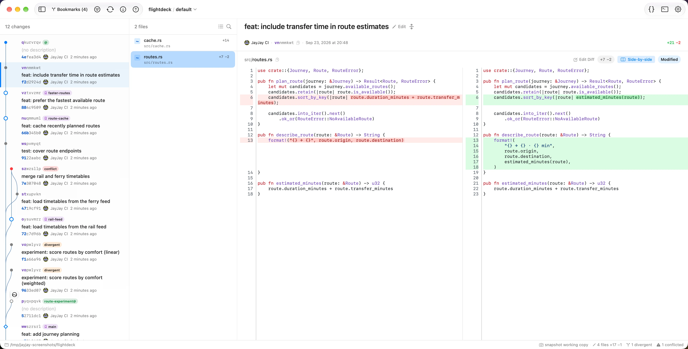
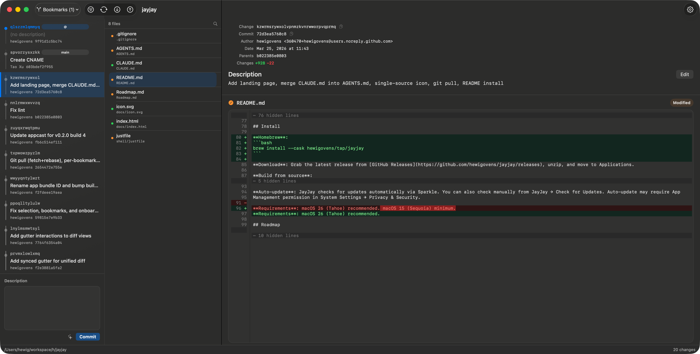

# JayJay

A native macOS GUI for [Jujutsu](https://github.com/jj-vcs/jj) version control.

> Fast, keyboard-driven, built with Rust + SwiftUI.

[](https://github.com/hewigovens/jayjay/actions/workflows/ci.yml)
[](https://github.com/hewigovens/jayjay/releases)


[](https://deepwiki.com/hewigovens/jayjay)

## Features

**History & Graph**
- DAG visualization with lane-based fork/merge rendering
- Bookmark and conflict indicators on every node
- Revset filtering with preset chips (All, Mine, Bookmarks, Trunk, Conflicts, Heads)
- Load more: incrementally load older history
- Auto-refresh via file system watcher

**Diff & Review**
- Unified + side-by-side diff modes (toggle with one click)
- Myers diff algorithm (via [`jj-diff`](#jj-diff) crate) — instant diffs even for large files
- Diff edit mode (`jj diffedit`-style): select files, hunks, or line ranges across a change
- Interdiff: compare any two revisions (shift-click or context menu)
- File annotate (blame) with syntax-highlighted gutter — click to navigate
- File history: list all revisions that modified a file
- tree-sitter syntax highlighting (18 languages)
- Word-level change highlighting
- Context collapsing, rename detection
- Background preloading of all file diffs
- Persistent file review state (survives restart, auto-invalidates on content change)

**Conflict Resolution**
- Conflicted files shown with warning indicator and resolution bar
- One-click "Use Ours" / "Use Theirs" resolution
- "Resolve in Editor" via `jj resolve --tool` (VS Code, Zed merge editors)
- Auto-refresh after resolution

**Operations**
- New, edit, describe, squash, abandon, split (with parallel option), graft, duplicate, merge
- Extract selected diff to child/parallel changes, move selected changes to `@`, discard selected working-copy changes
- Absorb hunks into ancestors, back out (revert) changes
- Git push/fetch with auto-track
- Bookmark Manager (⌘⇧B) with stats, filter, clean up stale branches, resolve conflicts
- Divergent commit detection and resolution
- Undo via operation log
- Command palette (⌘⇧P) with ~35 commands and jj CLI integration

**AI Commit Messages**
- Codex CLI, Claude CLI, Apple Intelligence fallback chain

**Tools & Settings**
- External editor integration (VS Code, Zed, Xcode, Android Studio, Vim + auto-detection)
- Terminal integration (Terminal.app, iTerm2, Ghostty)
- Dock menu with recent repositories
- Font family picker + ⌘+/-/0 zoom
- Commit avatars (GitHub + Gravatar)
- Multi-window, recent repos, CLI launcher with URL scheme

## Keyboard Shortcuts

| Key | Action |
|-----|--------|
| ⌘⇧P | Command palette |
| ⌘F | Find in diff |
| ⌘R | Refresh |
| ⌘O | Open repository |
| ⌘+/⌘-/⌘0 | Zoom in/out/reset |
| ⌘⇧B | Bookmark Manager |
| ⌘⇧U | Undo (operation log) |
| Space | Toggle file reviewed |
| Shift+Click | Compare two revisions (interdiff) |

## Screenshots

<p align="center">
  
</p>

<p align="center">
  
</p>

## Install

**Homebrew**:
```bash
brew install --cask hewigovens/tap/jayjay
```

**Download**: Grab the latest release from [GitHub Releases](https://github.com/hewigovens/jayjay/releases/latest), unzip, and move to Applications.

**Build from source**:
```bash
just run               # Build and run
just install-cli       # Install CLI launcher to ~/.local/bin
jayjay .               # Open current repo
```

**Auto-update**: JayJay checks for updates automatically via Sparkle. You can also check manually from JayJay → Check for Updates. Auto-update may require App Management permission in System Settings → Privacy & Security.

**Requirements**: macOS 26 (Tahoe) recommended.

## Roadmap

See [Roadmap.md](Roadmap.md) for near-term and long-term plans.

## Contributing

See [CONTRIBUTING.md](CONTRIBUTING.md) for architecture notes, development workflow, and the current `jj-lib` vs `jj` CLI backend split.

## jj-diff

The diff engine is extracted as a standalone Rust crate with **zero dependency on jj-lib**:

```toml
[dependencies]
jj-diff = { git = "https://github.com/hewigovens/jayjay" }
```

**Features:**
- Myers line diff (via `similar`) — O(n*d), same algorithm as libgit2/GitHub Desktop
- Word-level diff highlighting
- tree-sitter syntax highlighting (18 languages)
- Context collapsing with display-to-full line index mapping
- Skip highlighting for `.lock`/`.csv`/`.svg` files

**Usage:**
```rust
use jj_diff::{compute_file_diff, collapse_context_with_mapping};

let diff = compute_file_diff("main.rs", &old_content, &new_content, false);
let collapsed = collapse_context_with_mapping(&diff);
for line in &collapsed.diff.lines {
    // render line with line.style, line.spans
}
```

## License

- **Rust crates** (`crates/`): [Apache-2.0](crates/LICENSE)
- **macOS app** (`shell/`, everything else): [BSL 1.1](LICENSE) — free to use, modify, and redistribute; paid app store distribution requires permission. Converts to Apache-2.0 on 2030-03-23.
