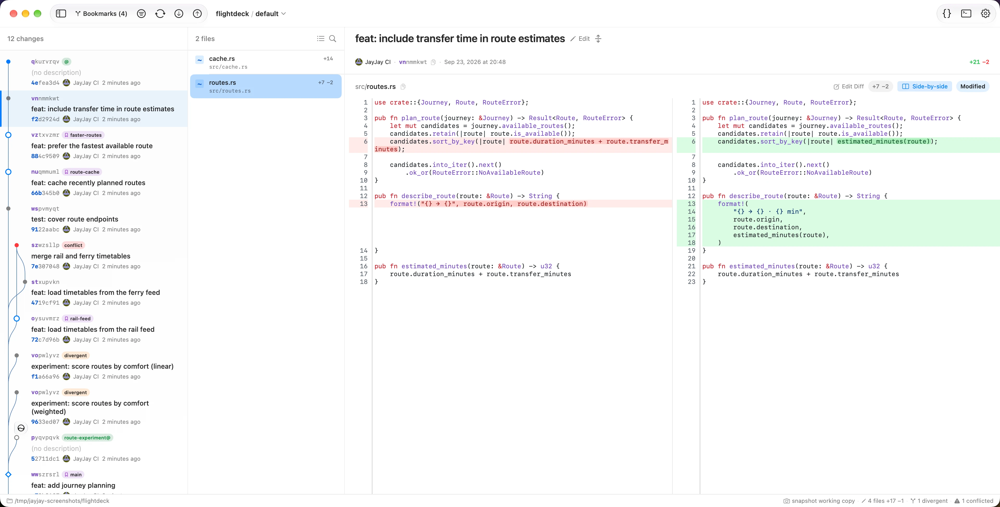

# JayJay

**JayJay is a native macOS and Linux GUI for [Jujutsu](https://github.com/jj-vcs/jj), with reusable Rust libraries for diff and review tooling.**

- **macOS:** native SwiftUI app.
- **Linux:** GPUI shell in beta. Its macOS build is for development.
- **Rust libraries:** diffing, review state, repository operations, and app bindings.

[Install on macOS](#install) · [Linux beta](#gpui-shell-beta) · [Rust libraries](#rust-libraries) · [Contribute](CONTRIBUTING.md)

[](https://github.com/hewigovens/jayjay/actions/workflows/ci.yml)
[](https://github.com/hewigovens/jayjay/releases)


[](https://deepwiki.com/hewigovens/jayjay)

## JayJay macOS App

JayJay is a fast, keyboard-driven GUI for people who use jj every day.

<p align="center">
  <picture>
    <source media="(prefers-color-scheme: dark)" srcset="docs/imgs/home-dark.webp">
    
  </picture>
</p>

### Highlights

- DAG visualization with bookmarks, tags, conflicts, author avatars, relative time, and revset filters.
- Unified and side-by-side diffs with syntax highlighting, word-level changes, context collapsing, rename detection, and image/SVG/Markdown/HTML previews.
- Interdiff for PR-style revision comparison, file annotate, file history, and change evolution (`jj evolog`).
- Diff edit mode: select files, hunks, or line ranges across a change.
- Persistent file and hunk review marks that preserve matching reviewed hunks across edits and rebases, with line-anchored review notes.
- Conflict resolution with whole-file or per-hunk choices, syntax-aware `-`/`+` gutters, a raw marker editor, and an explicit external `jj resolve --tool` handoff.
- Common jj operations from the app: new, edit, describe, squash, abandon, split, duplicate, merge, absorb, back out, Git push/fetch, and undo.
- Bookmark Manager, drag-to-move bookmarks and working copy, GitHub/GitLab/Codeberg/Cursor Origin PR actions, stacked PRs/MRs, and command palette.
- AI commit-message fallback chain: Codex CLI, Claude CLI, then Apple Intelligence.
- External editor and terminal integration, multi-window support, recent repos, Dock menu, and CLI launcher.
- `jayjay config` prints the paste-ready jj diff/edit/merge tool definition, also available from Settings → CLI.

See the [full feature guide](https://jayjay.hewig.dev/guide.html) for screenshots and workflows.

### Install

Requirements: **macOS 26 or later**.

Homebrew:

```bash
brew install --cask hewigovens/tap/jayjay
```

Direct download: grab the latest `.zip` from [GitHub Releases](https://github.com/hewigovens/jayjay/releases/latest), unzip, and move JayJay to Applications.

JayJay checks for updates automatically through Sparkle. You can also run **JayJay -> Check for Updates**.

### Feedback

Choose **Help -> Send Feedback** in JayJay to email us.

### Build the app

Follow [Contributing](CONTRIBUTING.md#setup) to install prerequisites, then:

```bash
just run          # Build and launch the SwiftUI macOS app
just install-cli  # Install the jayjay launcher to ~/.local/bin
jayjay .          # Open the current repo
```

## Rust Libraries

The Rust workspace keeps diff rendering, review state, and shared domain types independent of `jj-lib`.

| Crate | Role | `jj-lib`? |
| --- | --- | --- |
| [`jj-diff`](crates/jj-diff) | Standalone diff engine: histogram line diff, word diff, syntax highlighting, context collapse, side-by-side rows | No |
| `jayjay-primitives` | Shared jj-lib-free domain and review identity types | No |
| `jayjay-review` | Local review marks, notes, and reconciliation | No |
| `jayjay-network` | Shared blocking HTTP helpers | No |
| `jayjay-core` | App-facing repo operations, jj data access, mutations, and format projections | Yes |
| `jayjay-uniffi` | Swift bindings for the SwiftUI app | Through `jayjay-core` |
| `jayjay-cli` | Thin app launcher; command-line subcommands are served by the bundled macOS app executable | No |

Rule of thumb: `jj-lib` belongs in `jayjay-core`. Diff rendering, review state, and shared domain types stay below that boundary so they can be reused without embedding jj's repo model.

### `jj-diff`

`jj-diff` is the most reusable standalone library in the repo. It has **zero dependency on `jj-lib`**.

```toml
[dependencies]
jj-diff = { git = "https://github.com/hewigovens/jayjay" }
```

```rust
use jj_diff::{collapse_context_with_mapping, compute_file_diff};

let diff = compute_file_diff("main.rs", &old_content, &new_content, false);
let collapsed = collapse_context_with_mapping(&diff);

for line in &collapsed.diff.lines {
    // render line.style and line.spans in your UI
}
```

Features:

- Histogram line diff via `similar`.
- Word-level highlighting within changed lines.
- tree-sitter syntax highlighting for common source formats.
- Context collapsing with display-to-full line index mapping.
- Side-by-side row building for two-column renderers.
- Placeholder detection for Git LFS, submodules, and binary content.

See [`crates/jj-diff/README.md`](crates/jj-diff/README.md) for the full API.

## Docs

- [User Guide](https://jayjay.hewig.dev/guide.html) - shipped features and workflows (`docs/guide.html`).
- [Issues](https://github.com/hewigovens/jayjay/issues) - planned work and known gaps.
- [Contributing](CONTRIBUTING.md) - setup, development checks, testing, and pull request policy.
- [Agent instructions](AGENTS.md) - repository constraints and focused engineering guides; `CLAUDE.md` links to the same file.
- [DeepWiki](https://deepwiki.com/hewigovens/jayjay) - indexed codebase reference.
- [FAQ](https://jayjay.hewig.dev/#faq) - install, licensing, platform support, and common feature questions.
- [Blog](https://jayjay.hewig.dev/blog/) - notes on Jujutsu, collaboration, and the tools around them.

### GPUI Shell (Beta)

There is also a GPUI shell, now in beta, whose current parity target is Linux. Its macOS build is for development; the released macOS product remains the SwiftUI app. Remaining work is tracked in the [GPUI Beta checklist](https://github.com/hewigovens/jayjay/issues/165).

Linux builds ship with every release: download the AppImage for your architecture from the release page, or on Arch Linux install the attached `jayjay-appimage` package with `pacman -U`.

```bash
just gpui           # Build and launch the GPUI shell
just gpui-appimage  # Build the Linux AppImage
```

## Keyboard Shortcuts

| Key | Action |
| --- | --- |
| Cmd+Shift+P | Command palette |
| Cmd+F | Find in diff |
| Cmd+R | Refresh |
| Cmd+O | Open repository |
| Cmd+Plus / Cmd+Minus / Cmd+0 | Zoom in / out / reset |
| Cmd+Shift+B | Bookmark Manager |
| Cmd+Shift+U | Undo through operation log |
| Space | Toggle file reviewed |
| Shift+Click | Compare two revisions |

## License

- **Rust crates** (`crates/`): [Apache-2.0](crates/LICENSE)
- **App shells and everything else** (`shell/`, docs, packaging): [BSL 1.1](LICENSE) - free to use, modify, and redistribute; paid app store distribution requires permission. Converts to Apache-2.0 on 2030-03-23.
