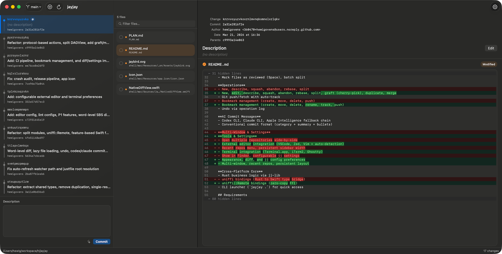
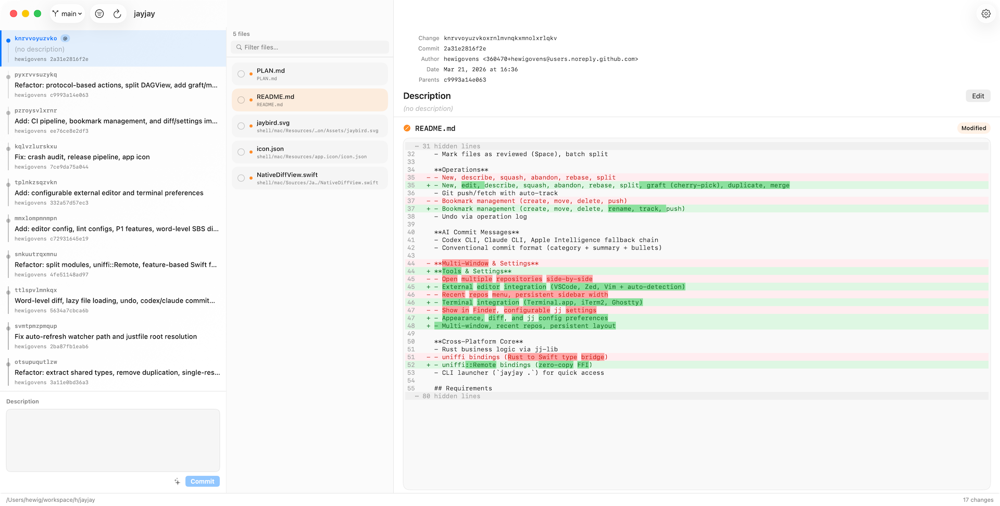

# JayJay

A native macOS GUI for [Jujutsu](https://github.com/jj-vcs/jj) version control.

> Fast, keyboard-driven, built with Rust + SwiftUI.


<p align="center">
  
</p>

<p align="center">
  
</p>

## Features

**History & Graph**
- DAG visualization with lane-based fork/merge rendering
- Bookmark and conflict indicators on every node
- Revset filtering for custom views
- Auto-refresh via file system watcher

**Diff & Review**
- Unified + side-by-side diff modes (toggle with one click)
- tree-sitter syntax highlighting (17 languages)
- Word-level change highlighting
- Context collapsing, rename detection
- Mark files as reviewed (Space), batch split

**Operations**
- New, edit, describe, squash, abandon, rebase, split, graft (cherry-pick), duplicate, merge
- Git push/fetch with auto-track
- Bookmark management (create, move, delete, rename, track, push)
- Undo via operation log

**AI Commit Messages**
- Codex CLI, Claude CLI, Apple Intelligence fallback chain
- Conventional commit format (category + summary + bullets)

**Tools & Settings**
- External editor integration (VSCode, Zed, Vim + auto-detection)
- Terminal integration (Terminal.app, iTerm2, Ghostty)
- Appearance, diff, and jj config preferences
- Multi-window, recent repos, persistent layout

**Cross-Platform Core**
- Rust business logic via jj-lib
- uniffi::Remote bindings (zero-copy FFI)
- CLI launcher (`jayjay .`) for quick access

## Requirements

| Dependency | Version |
|------------|---------|
| macOS | 14+ (Sonoma) |
| Rust | 1.85+ |
| Xcode | 16+ |
| jj | latest |
| just | latest |
| xcodegen | latest |
| xcbeautify | latest |

## Install

```bash
# Build from source
just run

# Build and open a specific repo
just run /path/to/jj/repo

# Install the CLI launcher into ~/.local/bin
just install-cli
jayjay .
```

Homebrew Cask distribution is planned for a future release.

## Keyboard Shortcuts

| Key | Action |
|-----|--------|
| Space | Toggle file reviewed |
| ↑/↓ | Navigate files |
| ⌘N | New change |
| ⌘R | Refresh |
| ⌘O | Open repository |
| ⌘⇧S | Squash into parent |
| ⌘⇧P | Git push |
| ⌘⇧F | Git fetch |
| ⌘⌫ | Abandon change |
| ⌘⌥F | Show in Finder |

## Architecture

```
Rust (crates/)                  Swift (shell/mac/)
├── jayjay-core                 ├── App/  Config, Window, Watcher
│   ├── repo (log, diff,        ├── Repo/ ViewModel, DAG, CommitBox
│   │   mutations, bookmarks,   ├── Detail/ files, tree view
│   │   git, working_copy,      ├── Diff/  unified, side-by-side
│   │   undo)                   ├── Settings/ prefs, jj config, about
│   ├── diff (LCS + word)       ├── Onboarding/ welcome flow
│   └── syntax (17 languages)   └── Shared/ reusable components
├── jayjay-uniffi ──── FFI ────
└── jayjay-cli (launcher)
```

| Layer | Tech | Role |
|-------|------|------|
| Model | Rust + jj-lib | Business logic, diff, syntax |
| Bindings | uniffi | Rust to Swift type bridge |
| ViewModel | `@Observable` | Async operations, state |
| View | SwiftUI + AppKit | Rendering |

## Contributing

This project uses [Jujutsu](https://github.com/jj-vcs/jj) for version control, not git.

```bash
just test      # Run Rust tests
just lint      # Clippy + SwiftLint
just format    # cargo fmt + SwiftFormat
just build     # Build the macOS app
```

See [AGENTS.md](AGENTS.md) for development guidelines.

## License

Apache-2.0
