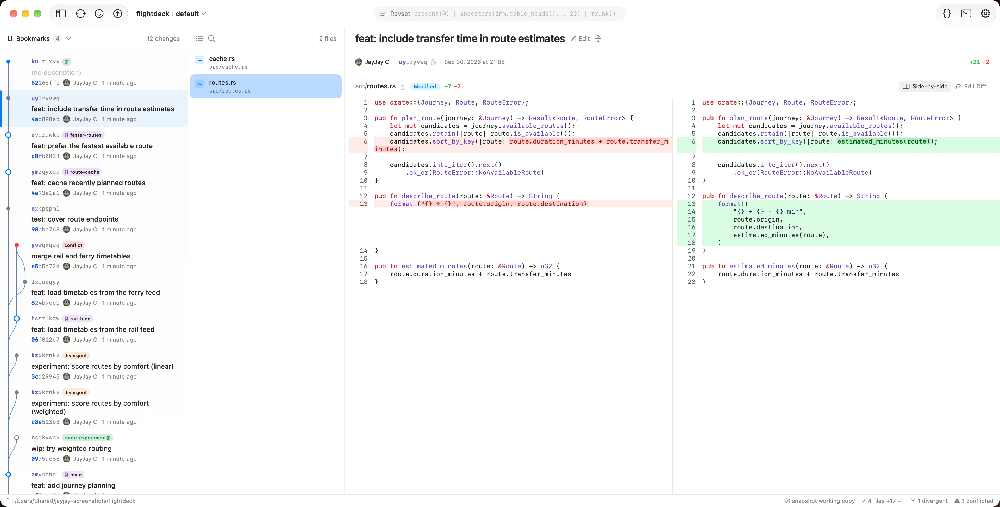

# JayJay


[](#linux)


[](https://discord.gg/ekknRNkVrT)
[](https://deepwiki.com/hewigovens/jayjay)

[](https://github.com/hewigovens/jayjay/actions/workflows/ci.yml)
[](https://github.com/hewigovens/jayjay/actions/workflows/gpui-ci.yml)
[](https://github.com/hewigovens/jayjay/releases)
[](https://github.com/hewigovens/jayjay/releases)

**JayJay is a native macOS and Linux GUI for [Jujutsu](https://github.com/jj-vcs/jj), with reusable Rust libraries for diff and review tooling.**

- **macOS:** native SwiftUI app.
- **Linux:** GPUI app. Its macOS build is for development.
- **Rust libraries:** diffing, review state, repository operations, and app bindings.


## JayJay App

JayJay is a fast, keyboard-friendly GUI for people who use jj every day.

<p align="center">
  <picture>
    <source media="(prefers-color-scheme: dark)" srcset="docs/imgs/home-dark.webp">
    
  </picture>
</p>

### Highlights

- **History:** a DAG of changes with bookmarks, tags, conflicts, divergent changes, and other workspaces' working copies; a revset bar with completion and presets; drag a change or a whole selection to rebase it, or drag bookmarks and `@` to move them.
- **Diffs:** unified and side-by-side with syntax highlighting, word-level changes, expandable context, and rename detection; rich previews for images, SVG, Markdown, HTML, notebooks, CSV/TSV, SARIF, and property lists; edit working-copy files in place.
- **Review:** file and per-hunk review marks that survive edits and rebases, line-anchored review notes, and a `jayjay review` CLI that lets coding agents read and resolve notes or pre-mark mechanical files.
- **Compare and inspect:** interdiff between revisions or bookmarks, divergent-version compare, annotate, file history, and change evolution (`jj evolog`) with Restore this version.
- **Split work:** select files, hunks, or line ranges and move them into a child, a sibling, or the working copy; split by review state; `jj split --tool jayjay` opens the same editor.
- **Conflicts:** a merge editor with per-conflict Accept Left, Right, or Base, a raw marker mode, one-click Use Ours and Use Theirs, and an explicit `jj resolve --tool` handoff.
- **Operations:** new, edit, describe, squash, split, rebase (including onto trunk), merge, parallelize, duplicate, absorb, revert, abandon, push, fetch, and undo from the operation log.
- **Workspaces:** create, switch in the current window, and forget workspaces; check out a pull request as a new workspace; the Repo Overview window shows every lane of mutable work and what needs attention.
- **Bookmarks and forges:** Bookmark Manager with remote sync state and cleanup; PR/MR links and CI status for GitHub, GitLab, Codeberg, and Cursor Origin; stacked PRs and MRs.
- **AI commit messages** from Codex CLI, Claude CLI, or Apple Intelligence, in the order you choose.
- **Keyboard friendly:** a command palette that also runs raw `jj` commands and finds help topics, Tab focus cycling, and [shortcuts](https://jayjay.hewig.dev/guide.html#shortcuts) for everyday actions.
- **Integrations:** external editors and terminals, pinned and recent repositories, multiple windows, the Dock menu, the `jayjay` CLI launcher, and `jayjay config` for jj and Git diff and merge tool definitions.

See the [full feature guide](https://jayjay.hewig.dev/guide.html) for screenshots and workflows.

### Install

#### macOS

Requires **macOS 26 or later**.

```bash
brew install --cask hewigovens/tap/jayjay
```

Or download the latest `.zip` from [GitHub Releases](https://github.com/hewigovens/jayjay/releases/latest), unzip it, and move JayJay to Applications. JayJay updates itself through Sparkle; choose **JayJay → Check for Updates** to check now.

**Beta builds:** set the update channel to **Beta** in **Settings → About**, then check for updates. To install a beta directly, download its `.zip` from its [pre-release page](https://github.com/hewigovens/jayjay/releases).

#### Linux

The Linux app is built for x86_64 and aarch64. The install script puts the AppImage in `~/.local/share/jayjay` and links `jayjay` into `~/.local/bin`:

```bash
curl -fsSL https://jayjay.hewig.dev/install.sh | bash
```

On Arch Linux, use the signed pacman repo instead, so stable upgrades arrive with `pacman -Syu`:

```bash
curl -fsSL https://jayjay.hewig.dev/install.sh | bash -s -- --pacman-repo
```

The [guide](https://jayjay.hewig.dev/guide.html#gpui) has the reviewable manual steps.

### Feedback

Join the [JayJay Discord community](https://discord.gg/ekknRNkVrT) to ask questions, share workflows, and give feedback.

Found a bug or want a feature? [Open an issue](https://github.com/hewigovens/jayjay/issues/new) on GitHub.

### Build the app

Follow [Contributing](CONTRIBUTING.md#setup) to install prerequisites, then:

```bash
just run            # Build and launch the SwiftUI macOS app
just install-cli    # Install the jayjay launcher to ~/.local/bin
jayjay .            # Open the current repo
just gpui           # Build and launch the GPUI app
just gpui-appimage  # Build the Linux AppImage
```

## Rust Libraries

The Rust workspace keeps diff rendering, review state, and shared domain types independent of `jj-lib`.

| Crate | Role | `jj-lib`? |
| --- | --- | --- |
| [`jj-diff`](crates/jj-diff) | Standalone diff engine: histogram line diff, word diff, syntax highlighting, context collapse, side-by-side rows | No |
| `jayjay-primitives` | Shared jj-lib-free domain and review identity types | No |
| `jayjay-review` | Local review marks, notes, and reconciliation | No |
| `jayjay-network` | Shared blocking HTTP helpers | No |
| `jayjay-core` | App-facing repo operations, jj data access, mutations, and format projections | Yes |
| `jayjay-uniffi` | Swift bindings for the SwiftUI app | Indirect |
| `jayjay-cli` | Thin app launcher; command-line subcommands are served by the bundled macOS app executable | No |

Rule of thumb: `jj-lib` belongs in `jayjay-core`. Diff rendering, review state, and shared domain types stay below that boundary so they can be reused without embedding jj's repo model.

### `jj-diff`

`jj-diff` is the most reusable standalone library in the repo. It has **zero dependency on `jj-lib`**.

```toml
[dependencies]
jj-diff = { git = "https://github.com/hewigovens/jayjay" }
```

```rust
use jj_diff::{collapse_context_with_mapping, compute_file_diff};

let diff = compute_file_diff("main.rs", &old_content, &new_content, false);
let collapsed = collapse_context_with_mapping(&diff);

for line in &collapsed.diff.lines {
    // render line.style and line.spans in your UI
}
```

Features:

- Histogram line diff via `similar`.
- Word-level highlighting within changed lines.
- tree-sitter syntax highlighting for common source formats.
- Context collapsing with display-to-full line index mapping.
- Side-by-side row building for two-column renderers.
- Placeholder detection for Git LFS, submodules, and binary content.

See [`crates/jj-diff/README.md`](crates/jj-diff/README.md) for the full API.

## Docs

- [User Guide](https://jayjay.hewig.dev/guide.html) - shipped features and workflows (`docs/guide.html`).
- [Keyboard Shortcuts](https://jayjay.hewig.dev/guide.html#shortcuts) - every shortcut, grouped by area; Cmd+/ opens a quick reference in the app.
- [Issues](https://github.com/hewigovens/jayjay/issues) - planned work and known gaps.
- [Contributing](CONTRIBUTING.md) - setup, development checks, testing, and pull request policy.
- [Agent instructions](AGENTS.md) - repository constraints and focused engineering guides.
- [DeepWiki](https://deepwiki.com/hewigovens/jayjay) - indexed codebase reference.
- [FAQ](https://jayjay.hewig.dev/#faq) - install, licensing, platform support, and common feature questions.
- [Blog](https://jayjay.hewig.dev/blog/) - notes on Jujutsu, collaboration, and the tools around them.

## License

- **Rust crates** (`crates/`): [Apache-2.0](crates/LICENSE)
- **Apps and everything else** (`shell/`, docs, packaging): [BSL 1.1](LICENSE) - free to use, modify, and redistribute; paid app store distribution requires permission. Converts to Apache-2.0 on 2030-03-23.
